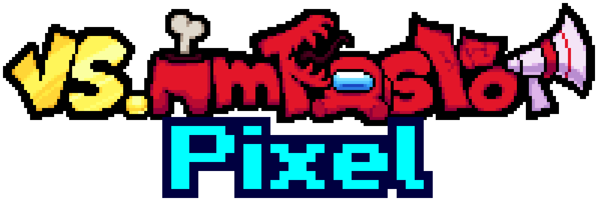

    <a href="https://github.com/kenton54/VS-IMPOSTOR-Pixel">
        <picture>
            <source media="(prefers-color-scheme: dark)" srcset="images/github/logo-dark-scaledx10.gif">
            <source media="(prefers-color-scheme: light)" srcset="images/github/logo-light-scaledx10.gif">
            
        </picture>
    </a>
    <h1>VS IMPOSTOR Pixel</h1> <!-- this is just here so the table of contents thing shows stuff properly (???) -->
    
<b>Created by <a href="https://github.com/kenton54">kenton</a></b>

     
    

        <b>VS IMPOSTOR Pixel</b> is a <a href="https://ninja-muffin24.itch.io/funkin">Friday Night Funkin'</a> Modification based on the mod <a href="https://vsimpostor.com">VS IMPOSTOR</a> created by the team IMPOSTORM, which itself is based of the very popular game and cultural meme <a href="https://www.innersloth.com/games/among-us">Among Us</a> made by <a href="https://www.innersloth.com">Innersloth</a>.
    

     
    

        This is an unnoficial sequel, meant to not only improve what's already been introduced to the table, but to expand on it as well. Expect this mod to be nearly double (or above, idk yet im writing this before 1.0 LOL) the size of the original <a href="https://vsimpostor.com">VS IMPOSTOR</a>.
    

     
    

        The mod is meant to be played with <a href="https://codename-engine.com">Codename Engine</a> (Version 1.0.1). The mod is fully compatible with Desktop and Mobile devices!
    

     
    

        Downloads
         
        <b>
        <a href="https://gamebanana.com/mods/506768">Gamebana</a>
        &middot;
        <a href="https://kenton54.itch.io/vs-impostor-pixel">Itch.io</a>
        &middot;
        <a href="https://drive.google.com/drive/folders/1D7bzf95Ig0HuAl6Zrm4iikSvv_Mc0cSm?usp=sharing">Google Drive</a>
        </b>
    

<h1 align="center">THE STORY</h1>
After Boyfriend finished his adventure across the VS IMPOSTOR universe, it is time for him to face off against Black Impostor in one epic final song!!11!1!

But things don't turn out so well for Boyfriend because Black Impostor doesn't want to admit defeat! In one desperate attempt, he tries to kill Boyfriend, but he's too elusive for him! Boyfriend manages to dodge every single one of Black Impostor's attacks and escapes! However he doesn't get too far before meeting a dead end, Black Impostor now has him cornered! there's no way that kid could escape.

Reality itself around them started breaking. Boyfriend, with no other option, jumps into the crumbling void behind him, in an attempt to escape from Black.

Black, seeing how his prey managed to find a way to escape from him AGAIN, decides to restart the entire timeline to have a better chance of capturing him and surely make him pay for all the mockery he made of Black, which resets all of Boyfriend's progress in the process. But something didn't go according to Black's plan... everything is now pixelated!

Now Boyfriend has to go through every single one of the past lobbies he ventured already, meeting the same crew and impostors he once fought against valiantly, but now with new faces thrown into the equation and more dangerous foes to battle against, in a different view style! Will Boyfriend succeed once again? or will Black end his odyssey and succeed in his mission...?

<h1 align="center">THE TEAM BEHIND THE MOD</h1>

## Director
- kenton

## Artists, Pixel-Artists and Animators
- kenton
- GTM
- AstroNomad

## Programmers
- kenton
- AstroNomad

## Musicians
- Sparkly
- Oxzy
- Silte
- VoltR

## Charters
- kenton

## Translators
<table>
    <tr>
        <th>Translator</th>
        <th>Language</th>
    </tr>
    <tr>
        <td>kenton</td>
        <td>Spanish</td>
    </tr>
    <tr>
        <td>Moxt</td>
        <td>French</td>
    </tr>
    <tr>
        <td>Wøvenx</td>
        <td>Portuguese</td>
    </tr>
    <tr>
        <td>FuniFred</td>
        <td>Russian</td>
    </tr>
    <tr>
        <td>JustAlexus</td>
        <td>German</td>
    </tr>
    <tr>
        <td>Huy1234TH</td>
        <td>Vietnamese</td>
    </tr>
</table>

<h1 align="center"></h1>
THIS IS AN UNOFFICIAL FAN-MADE MODIFICATION OF <a href="https://ninja-muffin24.itch.io/funkin">Friday Night Funkin'</a> AND WE'RE NOT AFFILIATED WITH OR ENDORSED BY <a href="https://funkin.me/">The Funkin' Crew Inc.</a> OR <a href="https://www.innersloth.com">Innersloth</a>.

All rights belong to their respective owners.
